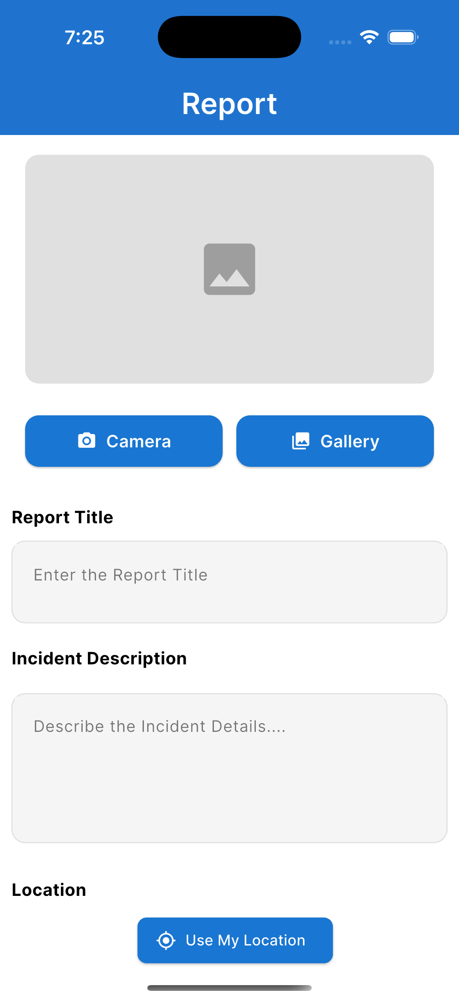
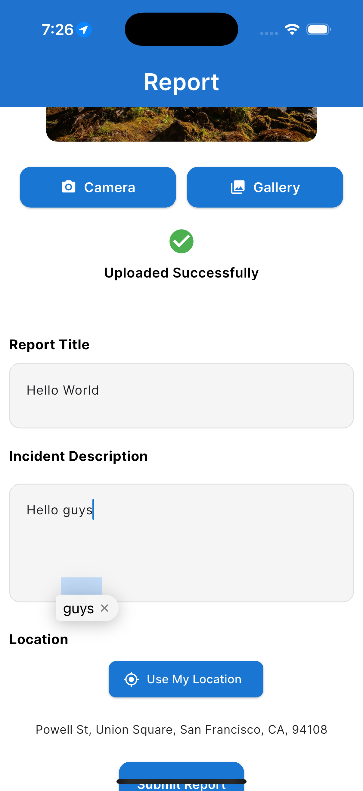
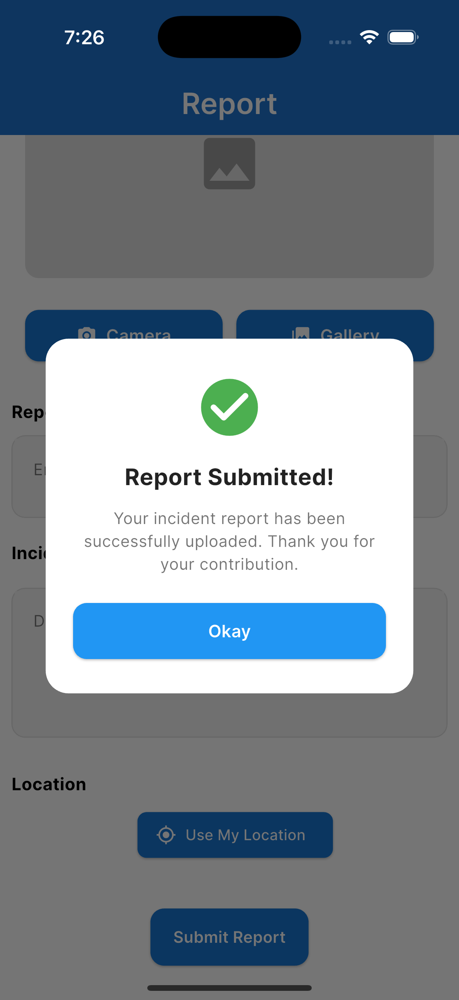
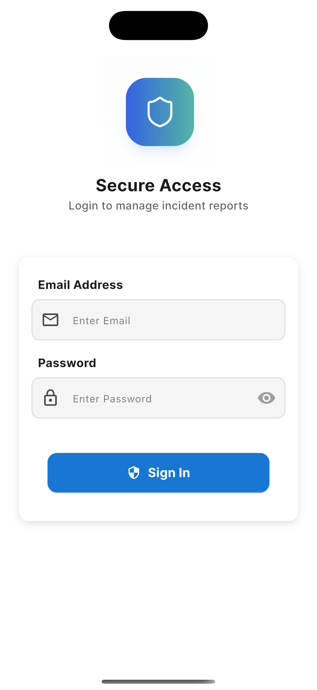
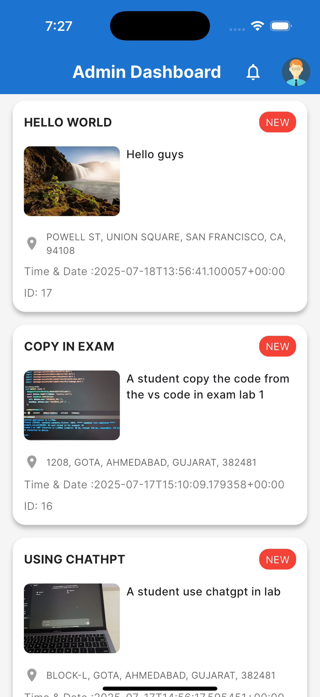
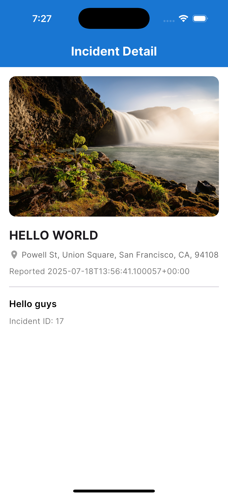
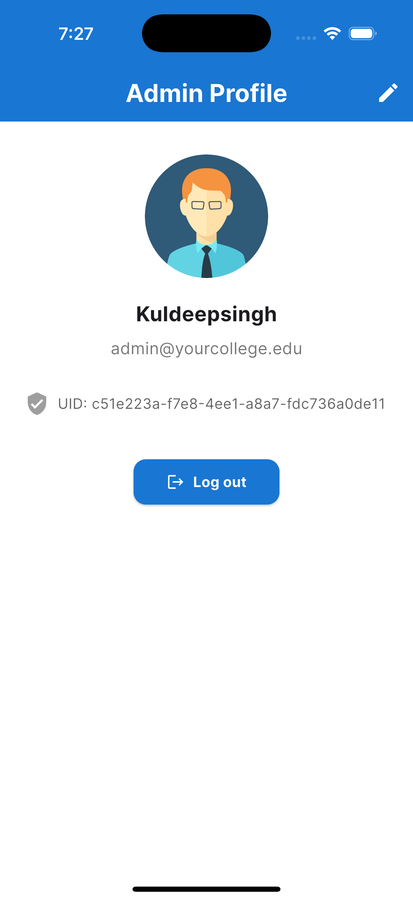
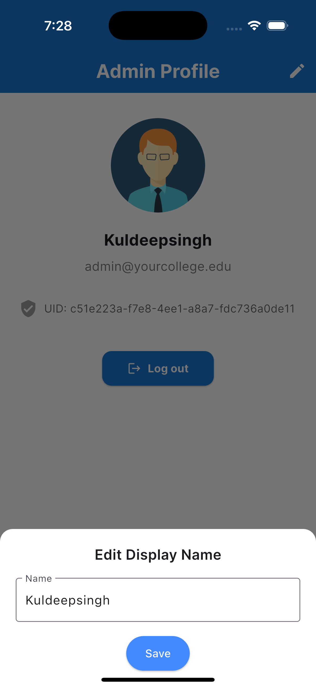
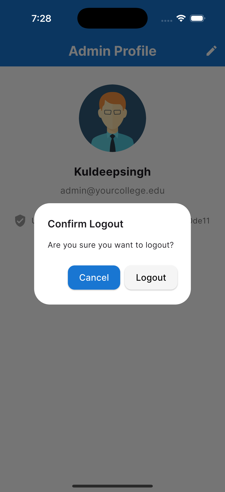

# 🏢 Unisafe - University Incident Reporting System

**Unisafe** is a Flutter-based mobile and web application that empowers university students to **anonymously report** incidents such as ragging, smoking, harassment, and more. It provides a safe, secure, and structured communication channel between students and administrators to **ensure campus safety**.

---

## 🚀 Features

### 👨‍🎓 Student Side (Mobile App)

- ✅ **Anonymous Reporting** – No login required
- 📸 **Upload Photo** – Capture and attach incident evidence
- 📝 **Enter Description** – Provide details about the incident
- 📍 **Specify Location** – Input area or building where it happened
- 🕒 **Auto Timestamp** – Record the time of submission
- 🔄 **Real-time Submission** – Reports pushed directly to admin panel

### 👨‍💼 Admin Side (Web + App)

- 🔐 **Login via Email & Password (Supabase Auth)**
- 📊 **Dashboard View** – List of all submitted reports
- 🧾 **View Report Details** – Image, description, location, timestamp
- ❌ **Delete Reports** – Remove handled or false reports
- ✍️ **Update Admin Name** – Change display name from AppBar
- 💾 **Auto-Login** – Using SharedPreferences
- ⚡ **Realtime Updates** – New reports appear instantly

---

## 🧰 Tech Stack

- **Flutter** – Cross-platform mobile & web app development
- **Supabase**:
  - 🔐 Auth – Secure admin login
  - 🗄️ Database – Store reports
  - ☁️ Storage – Upload images
  - ⚡ Realtime – Live updates
- **Google Fonts** – Stylish typography
- **Shared Preferences** – Persist admin session after login

---

## 📱 Screenshots

| Student Report Screen | Admin Dashboard |
|-----------------------|-----------------|
<p align="center">
  
  
  
   
   
   
   
   
   
  
  
</p>

## 📋 How to Run

1. **Clone the repo**:

```bash
git clone https://github.com/your-username/unisafe.git
cd unisafe
